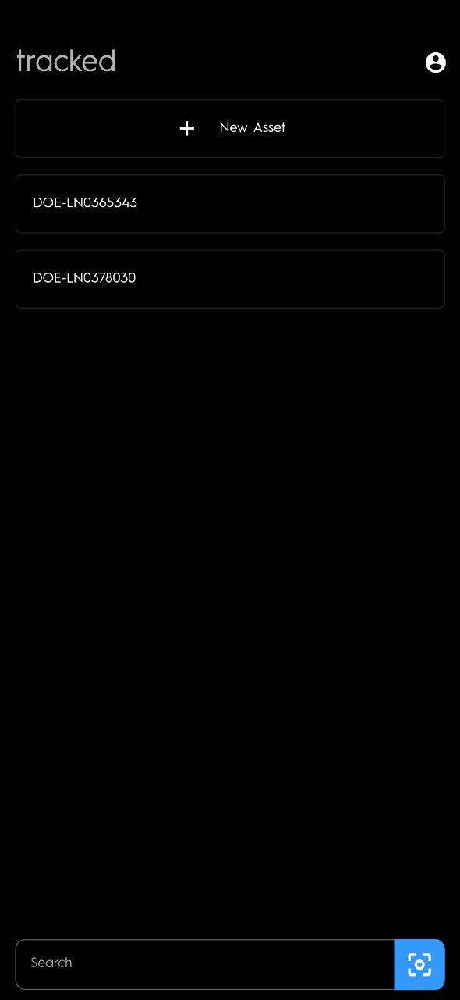
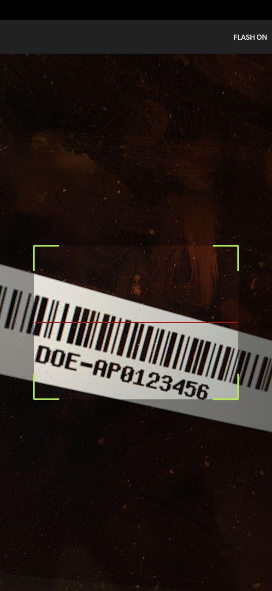
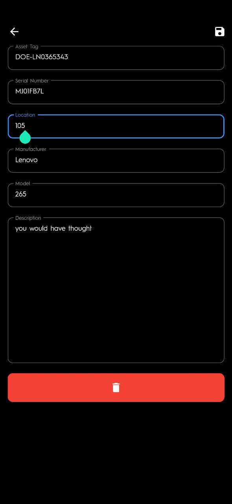
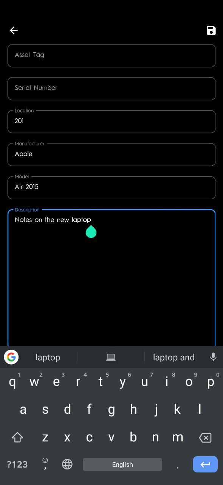

# tracked

Track Department of Education assets

|                                 |                                 |                                 |                                 |
| ------------------------------- | ------------------------------- | ------------------------------- | ------------------------------- |
|  |  |  |  |

## Features

- Minimal Dark UI
- Scan to Search
- Access to account from any flutter supported device from anywhere
- (Coming) Filter by specific asset field
- (Coming) Bulk modification of assets
- (Coming) Desktop Support

## Technologies

- [Flutter](https://flutter.dev)
- [Firebase](http://firebase.google.com)
